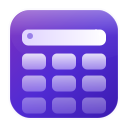
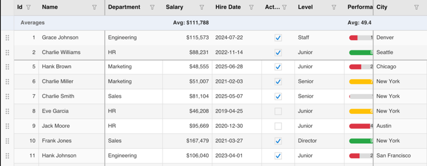
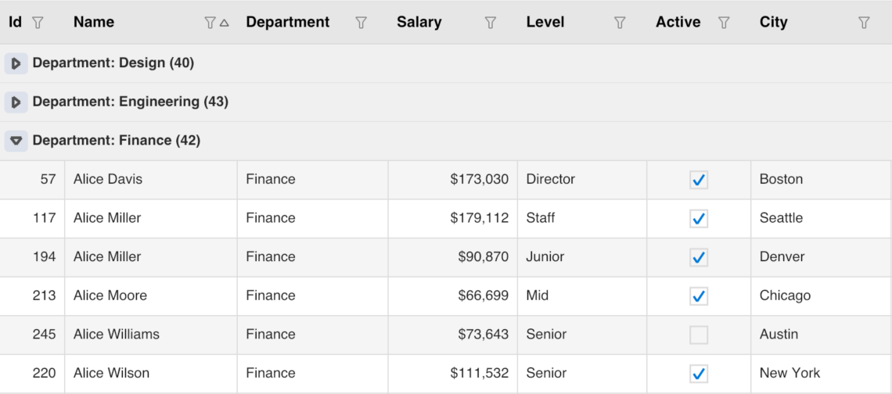
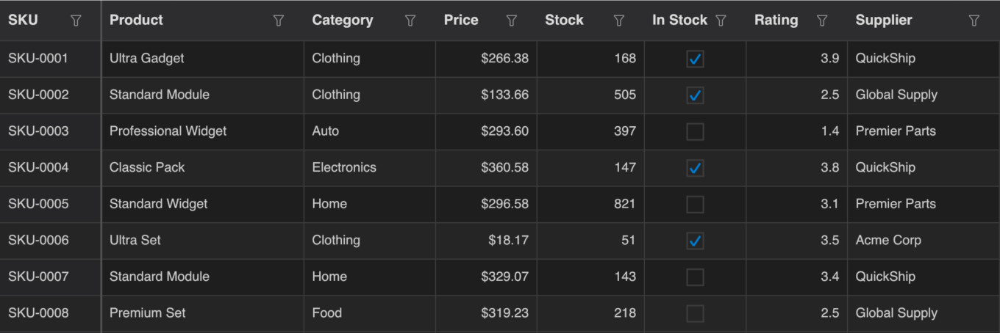

<p align="center">
  
  <h1 align="center">.NET KumikoUI</h1>
  <p align="center">
    A high-performance, fully canvas-drawn DataGrid for .NET — zero native controls, pixel-perfect on every platform.
  </p>
  <p align="center">
    <a href="#-getting-started">Getting Started</a> ·
    <a href="#-column-types">Columns</a> ·
    <a href="#-action-button-columns">Action Buttons</a> ·
    <a href="#-sorting--filtering">Sorting & Filtering</a> ·
    <a href="#-grouping">Grouping</a> ·
    <a href="#-editing">Editing</a> ·
    <a href="#-theming">Theming</a> ·
    <a href="#-architecture">Architecture</a>
  </p>
  <p align="center">
    
    
    
    
  </p>
  <p align="center">
    <a href="https://www.nuget.org/packages/KumikoUI.Maui"></a>
    <a href="https://www.nuget.org/packages/KumikoUI.SkiaSharp"></a>
    <a href="https://www.nuget.org/packages/KumikoUI.Core"></a>
  </p>
</p>

---

Every visual element — cells, headers, editors, scrollbars, popups — is rendered directly on a SkiaSharp canvas. There are **zero native UIKit / AppKit / WinUI controls**, giving you identical, pixel-perfect output across iOS, Android, macOS Catalyst, and Windows.

## Contents

- [Features at a Glance](#-features-at-a-glance)
- [Getting Started](#-getting-started)
- [Column Types](#-column-types)
- [Action Button Columns](#-action-button-columns)
- [Column Sizing](#-column-sizing)
- [Frozen Columns & Rows](#-frozen-columns--rows)
- [Sorting & Filtering](#-sorting--filtering)
- [Grouping](#-grouping)
- [Summaries](#-summaries)
- [Editing](#-editing)
- [Selection](#-selection)
- [Keyboard Navigation](#-keyboard-navigation)
- [Row Drag & Drop](#-row-drag--drop)
- [Theming & Styling](#-theming--styling)
- [Scrolling & Performance](#-scrolling--performance)
- [Live Data](#-live-data)
- [Architecture](#-architecture)
- [Sample Application](#-sample-application)
- [Requirements](#-requirements)
- [Contributing](#-contributing)
- [License](#-license)

---

<p align="center">
  
</p>

---

## ✨ Features at a Glance

| Category | Highlights |
|---|---|
| **Rendering** | 100% SkiaSharp canvas, zero native controls, 60 fps |
| **Virtual scrolling** | Only visible rows/columns rendered — tested with 100K+ rows |
| **Column types** | Text, Numeric, Boolean, Date, ComboBox, Picker, ProgressBar, Image, Template |
| **Action buttons** | Pill-button columns with `ICommand` / callback support; activate on first tap |
| **Column sizing** | Fixed, Star (proportional), Auto (content-sized) |
| **Frozen columns** | Pin columns to left or right edge |
| **Frozen rows** | Pin top N rows to viewport |
| **Sorting** | Tap header to cycle asc/desc/none; multi-column |
| **Filtering** | Excel-style popup with search, value checklist, and sort controls |
| **Grouping** | Drag-and-drop group panel, expandable groups, nested groups |
| **Summaries** | Table-level and per-group aggregates (Sum, Avg, Count, Min, Max) |
| **Editing** | Configurable triggers (tap, double-tap, long-press, F2, typing); per-column override |
| **Selection** | Single / Multiple / Extended modes; Row or Cell unit |
| **Keyboard nav** | Arrows, Tab/Shift+Tab, Enter, Home/End, Page Up/Down |
| **Row drag & drop** | Handle column or full-row drag reorder |
| **Theming** | Built-in Light / Dark / HighContrast; fully customisable style object |
| **Momentum scrolling** | Physics-based inertial scroll with configurable friction |
| **Live data** | `INotifyPropertyChanged` and `ObservableCollection` O(1) updates |
| **Column resizing** | Drag column border |

---

## 🚀 Getting Started

### 0. Install NuGet packages

For a .NET MAUI app, add **KumikoUI.Maui** (which transitively brings in `KumikoUI.Core` and `KumikoUI.SkiaSharp`):

```shell
dotnet add package KumikoUI.Maui
```

| Package | Description |
|---|---|
| [`KumikoUI.Maui`](https://www.nuget.org/packages/KumikoUI.Maui) | `DataGridView` MAUI control + MAUI hosting extensions |
| [`KumikoUI.SkiaSharp`](https://www.nuget.org/packages/KumikoUI.SkiaSharp) | SkiaSharp drawing context implementation |
| [`KumikoUI.Core`](https://www.nuget.org/packages/KumikoUI.Core) | Platform-agnostic layout, rendering pipeline, and models |

---

### 1. Register the KumikoUI

In `MauiProgram.cs`, call `UseSkiaKumikoUI()`:

```csharp
var builder = MauiApp.CreateBuilder();
builder
    .UseMauiApp<App>()
    .UseSkiaKumikoUI();   // registers SkiaSharp KumikoUI services
```

### 2. Add XAML namespaces

```xml
<ContentPage
    xmlns:dg="clr-namespace:KumikoUI.Maui;assembly=KumikoUI.Maui"
    xmlns:core="clr-namespace:KumikoUI.Core.Models;assembly=KumikoUI.Core">
```

### 3. Declare the DataGridView

```xml
<dg:DataGridView x:Name="kumiko"
                 ItemsSource="{Binding Items}"
                 RowHeight="36"
                 HeaderHeight="40">
    <dg:DataGridView.Columns>
        <core:DataGridColumn Header="Name"   PropertyName="Name"     Width="180" />
        <core:DataGridColumn Header="Age"    PropertyName="Age"      Width="80"
                             ColumnType="Numeric" TextAlignment="Right" />
        <core:DataGridColumn Header="Active" PropertyName="IsActive" Width="80"
                             ColumnType="Boolean" />
    </dg:DataGridView.Columns>
</dg:DataGridView>
```

---

## 📋 Column Types

Each column is a `DataGridColumn` with a `ColumnType` that controls both the read-only cell renderer and the inline editor.

| `ColumnType` | Cell Renderer | Editor | Notes |
|---|---|---|---|
| `Text` | Left-aligned text | `DrawnTextBox` | Default type |
| `Numeric` | Formatted number | `DrawnTextBox` (numeric) | Set `Format` (e.g. `"C0"`, `"N2"`) |
| `Boolean` | Checkbox glyph | `DrawnCheckBox` | Three-state (checked / unchecked / indeterminate) |
| `Date` | Formatted date | `DrawnDatePicker` | Calendar popup with month navigation |
| `ComboBox` | Selected value | `DrawnComboBox` | Searchable dropdown; set `EditorItemsString` |
| `Picker` | Selected value | `DrawnScrollPicker` | Mobile-style scroll wheel with physics snap |
| `Image` | Centered image | — (read-only) | Aspect-ratio preserving |
| `ProgressBar` | Progress bar | `DrawnProgressBar` | Interactive slider when editable |
| `Template` | Custom | Custom (`EditorDescriptor`) | Provide your own `ICellRenderer` |

### Column declaration example

```xml
<core:DataGridColumn Header="Department"
                     PropertyName="Department"
                     Width="140"
                     ColumnType="ComboBox"
                     EditorItemsString="Engineering,Marketing,Sales,HR,Finance" />

<core:DataGridColumn Header="Salary"
                     PropertyName="Salary"
                     Width="120"
                     ColumnType="Numeric"
                     Format="C0"
                     TextAlignment="Right" />

<core:DataGridColumn Header="Rating"
                     PropertyName="Rating"
                     Width="120"
                     ColumnType="ProgressBar" />
```

### Read-only and tab behavior

```xml
<core:DataGridColumn Header="Id" PropertyName="Id"
                     IsReadOnly="True"
                     AllowTabStop="False" />
```

---

## 🖱️ Action Button Columns

Action button columns render a row of clickable pill-buttons directly inside every cell. Any number of buttons can be declared; they are distributed with equal widths across the cell area. Buttons support both `ICommand` (for MVVM data-binding) and an `Action` callback (for code-behind).

Action buttons use the **Template** column type with `ActionButtonsCellRenderer` as the `CustomCellRenderer`. The renderer also implements `ICellEditorProvider`, so no separate `CustomEditorFactory` is required — the same button definitions handle both display and interaction.

> **Tip:** Set the column's `EditTriggers="SingleTap"` so buttons respond on the first touch, even when the grid's default trigger is `DoubleTap`. See [Per-column edit trigger override](#per-column-edit-trigger-override).

### XAML declaration (MVVM)

Set `PropertyName=""` so the full row item is passed as the value to both the renderer and the editor.
`MauiActionButtonDefinition` is a `BindableObject` that supports `{Binding}` on every property, including `Command`.

```xml
xmlns:dg="clr-namespace:KumikoUI.Maui;assembly=KumikoUI.Maui"
xmlns:render="clr-namespace:KumikoUI.Core.Rendering;assembly=KumikoUI.Core"

<dg:DataGridView x:Name="actionsGrid" ...>
    <dg:DataGridView.Columns>
        <core:DataGridColumn Header="Actions"
                             PropertyName=""
                             ColumnType="Template"
                             Width="200"
                             AllowSorting="False"
                             AllowFiltering="False"
                             AllowTabStop="False"
                             EditTriggers="SingleTap">
            <core:DataGridColumn.CustomCellRenderer>
                <render:ActionButtonsCellRenderer>
                    <render:ActionButtonsCellRenderer.Buttons>
                        <dg:MauiActionButtonDefinition
                            Label="Details"
                            BackgroundColor="13,110,253"
                            Command="{Binding Path=BindingContext.ViewDetailsCommand,
                                              Source={x:Reference actionsGrid}}" />
                        <dg:MauiActionButtonDefinition
                            Label="Delete"
                            BackgroundColor="220,53,69"
                            Command="{Binding Path=BindingContext.DeleteCommand,
                                              Source={x:Reference actionsGrid}}" />
                    </render:ActionButtonsCellRenderer.Buttons>
                </render:ActionButtonsCellRenderer>
            </core:DataGridColumn.CustomCellRenderer>
        </core:DataGridColumn>
    </dg:DataGridView.Columns>
</dg:DataGridView>
```

> **Note:** `MauiActionButtonDefinition` is not in the visual tree, so it does **not** inherit `BindingContext` automatically. Use `Source={x:Reference …}` or `Source={RelativeSource …}` to point bindings at the correct source object.

### Code-behind factory

Use `ActionButtonDefinition` (in `KumikoUI.Core`) when you want a code-behind closure per row:

```csharp
actionsColumn.CustomEditorFactory = (value, bounds) => new DrawnActionButtons
{
    Bounds  = bounds,
    RowItem = value,
    Buttons =
    [
        new ActionButtonDefinition
        {
            Label           = "Edit",
            BackgroundColor = new GridColor(13, 110, 253),
            Command         = vm.EditCommand   // row item is CommandParameter by default
        },
        new ActionButtonDefinition
        {
            Label           = "Delete",
            BackgroundColor = new GridColor(220, 53, 69),
            Action          = () => vm.DeleteEmployee((Employee)value!)
        }
    ]
};
```

### Button properties

| Property | Type | Description |
|---|---|---|
| `Label` | `string` | Text displayed on the button face |
| `BackgroundColor` | `GridColor` | Pill background color (`R,G,B` string format in XAML) |
| `TextColor` | `GridColor` | Label text color (default: white) |
| `Command` | `ICommand?` | Executed on tap; row item is the default `CommandParameter` |
| `CommandParameter` | `object?` | Explicit command parameter; overrides the row item default |
| `Action` | `Action?` | Code-behind callback; executed in addition to `Command` if both are set |

Layout properties on `DrawnActionButtons` / `ActionButtonsCellRenderer`:

| Property | Default | Description |
|---|---|---|
| `CornerRadius` | `5f` | Button pill corner radius (pixels) |
| `ButtonSpacing` | `6f` | Horizontal gap between buttons (pixels) |
| `CellPadding` | `4f` | Inset from all four cell edges (pixels) |

---

## 📐 Column Sizing

Columns support three sizing modes controlled by the `SizeMode` property.

| `SizeMode` | Behavior |
|---|---|
| `Fixed` | Exact pixel width set via `Width` (default) |
| `Auto` | Measures header text + visible cell content; respects a `MinWidth`/`MaxWidth` clamp |
| `Star` | Weighted share of remaining space after Fixed and Auto columns; set `Width="*"` or `"2*"` |

Modes can be mixed freely — the layout engine resolves them in a single pass per frame.

---

## 📌 Frozen Columns & Rows

### Frozen columns

Columns can be pinned to the left or right edge and will never scroll out of view.

```xml
<!-- Pin to left (default freeze side) -->
<core:DataGridColumn Header="Id"    PropertyName="Id"    IsFrozen="True" />
<core:DataGridColumn Header="Name"  PropertyName="Name"  IsFrozen="True" />

<!-- Pin to right -->
<core:DataGridColumn Header="Total" PropertyName="Total" FreezeMode="Right" />
```

The renderer uses 3-pass clip regions so frozen columns naturally overlay scrollable content with correct z-ordering.

### Frozen rows

Pin the first N rows so they remain visible while the rest of the data scrolls:

```xml
<dg:DataGridView FrozenRowCount="2" ... />
```

---

## 🔀 Sorting & Filtering

### Sorting

Tap any column header to sort. The indicator cycles through **Ascending → Descending → None**. Multi-column sort is supported — hold the sort state on multiple columns simultaneously via code:

```csharp
// Set ascending sort on a column, then refresh:
lastNameColumn.SortDirection = SortDirection.Ascending;
kumiko.DataSource.Refresh();
```

### Filtering

Every column header displays a filter icon. Tapping it opens an **Excel-style filter popup** that provides:

- Full-text search across all values in that column
- Value checklist (check/uncheck individual values)
- Quick sort buttons (A→Z / Z→A) inside the popup

Filters are applied immediately on close and stacked across columns. Remove a filter by opening the popup and selecting all values.

---

## 🗂️ Grouping

Add one or more `GroupDescription` objects to enable a collapsible group hierarchy with an interactive drag-and-drop group panel above the header.

```csharp
kumiko.DataSource.AddGroupDescription(new GroupDescription("Department"));
kumiko.DataSource.AddGroupDescription(new GroupDescription("Level"));
```

Groups are expanded by default. You can bulk-expand or collapse:

```csharp
kumiko.DataSource.ExpandAllGroups();
kumiko.DataSource.CollapseAllGroups();
```

Remove grouping:

```csharp
kumiko.DataSource.ClearGroupDescriptions();
```

Group summaries (aggregate values per group) are declared with `AddGroupSummaryRow()` — see [Summaries](#-summaries) below.

---

## Σ Summaries

Summaries appear as pinned rows at the top or bottom of the grid (table summaries) or at the bottom of each group (group summaries).

### Table summaries (XAML)

```xml
<dg:DataGridView.TableSummaryRows>
    <core:TableSummaryRow Name="Totals" Position="Bottom" Title="Totals">
        <core:TableSummaryRow.Columns>
            <core:SummaryColumnDescription PropertyName="Salary"
                                           SummaryType="Sum"   Format="C0" />
            <core:SummaryColumnDescription PropertyName="Id"
                                           SummaryType="Count" Label="Rows: " />
            <core:SummaryColumnDescription PropertyName="Salary"
                                           SummaryType="Average" Format="C0"
                                           Label="Avg: " />
        </core:TableSummaryRow.Columns>
    </core:TableSummaryRow>
</dg:DataGridView.TableSummaryRows>
```

### Group summaries (code)

```csharp
kumiko.DataSource.AddGroupSummaryRow(new SummaryDescription
{
    Columns =
    {
        new SummaryColumnDescription { PropertyName = "Salary", SummaryType = SummaryType.Sum,   Format = "C0" },
        new SummaryColumnDescription { PropertyName = "Salary", SummaryType = SummaryType.Average, Format = "C0", Label = "Avg: " }
    }
});
```

### Available summary types

`Sum` · `Average` · `Count` · `Min` · `Max`

---

## ✏️ Editing

### Edit triggers

Configure which gestures or keys open the inline editor:

```xml
<dg:DataGridView EditTriggers="DoubleTap,F2Key,Typing"
                 EditTextSelectionMode="SelectAll"
                 DismissKeyboardOnEnter="True" />
```

| Trigger | Description |
|---|---|
| `SingleTap` | Single tap on a cell |
| `DoubleTap` | Double-tap (default) |
| `LongPress` | Long-press gesture |
| `F2Key` | F2 keyboard shortcut |
| `Typing` | Start typing immediately to replace cell content |

Triggers are flags — combine freely: `"DoubleTap,F2Key,Typing"`.

### Per-column edit trigger override

Each column can override the grid-level `EditTriggers` independently via its own `EditTriggers` property. When set, that column uses its own trigger flags; when `null` (the default), the column inherits the grid-level setting.

```xml
<dg:DataGridView EditTriggers="DoubleTap, F2Key, Typing">
    <dg:DataGridView.Columns>

        <!-- Most accessible: single-tap, F2, or typing to edit -->
        <core:DataGridColumn Header="Name" PropertyName="Name"
                             EditTriggers="SingleTap, F2Key, Typing" />

        <!-- ComboBox: double-tap or F2 only (no accidental typing edits) -->
        <core:DataGridColumn Header="Department" PropertyName="Department"
                             ColumnType="ComboBox"
                             EditorItemsString="Engineering,Marketing,Finance,HR"
                             EditTriggers="DoubleTap, F2Key" />

        <!-- Salary: keyboard-only — protects financial data from pointer gestures -->
        <core:DataGridColumn Header="Salary" PropertyName="Salary"
                             ColumnType="Numeric" Format="C0"
                             EditTriggers="F2Key" />

        <!-- Action buttons always activate on first tap -->
        <core:DataGridColumn Header="Actions" PropertyName=""
                             ColumnType="Template"
                             EditTriggers="SingleTap" />

    </dg:DataGridView.Columns>
</dg:DataGridView>
```

Set `EditTriggers="None"` to suppress all gesture/keyboard triggers for a column without making it fully read-only via `IsReadOnly`.

### Edit text selection

```xml
<!-- Select all existing text when the editor opens -->
<dg:DataGridView EditTextSelectionMode="SelectAll" />

<!-- Or keep cursor at end -->
<dg:DataGridView EditTextSelectionMode="End" />
```

### Commit / cancel

- **Enter** — commit and move to the next row
- **Tab / Shift+Tab** — commit and move to the next/previous editable cell
- **Escape** — cancel and restore the original value

### Custom editors

For `Template` columns supply an `EditorDescriptor`:

```csharp
var column = new DataGridColumn
{
    Header = "Rating",
    PropertyName = "Rating",
    ColumnType = DataGridColumnType.Template,
    EditorDescriptor = new NumericUpDownEditorDescriptor { Min = 0, Max = 10, Step = 1 }
};
```

---

## ☑️ Selection

### Selection mode

```xml
<dg:DataGridView GridSelectionMode="Multiple" />
```

| `SelectionMode` | Behavior |
|---|---|
| `Single` | One item at a time |
| `Multiple` | Each tap toggles the item |
| `Extended` | Click + Shift/Ctrl range/toggle (desktop-style) |

| `SelectionUnit` | Behavior |
|---|---|
| `Row` | Whole row is selected |
| `Cell` | Individual cell is selected |

### Reading selections (code)

```csharp
var selectedRows = kumiko.Selection.SelectedRows;   // HashSet<int> of row indices
var selectedCells = kumiko.Selection.SelectedCells;  // HashSet<CellPosition>
```

---

## ⌨️ Keyboard Navigation

Full keyboard navigation is supported on all platforms (iOS/macOS via `UIKeyCommand`, Android via hidden `Entry` with IME diffing, Windows via hidden `Entry`).

| Key | Action |
|---|---|
| `Arrow keys` | Move selection one cell/row |
| `Tab` | Move to next editable cell (wraps rows) |
| `Shift+Tab` | Move to previous editable cell |
| `Enter` | Commit edit / open edit on selected cell |
| `Escape` | Cancel edit |
| `F2` | Open inline editor (if `F2Key` trigger enabled) |
| `Home` / `End` | First / last cell in row |
| `Ctrl+Home` / `Ctrl+End` | First / last cell in grid |
| `Page Up` / `Page Down` | Scroll one viewport height |

---

## ↕️ Row Drag & Drop

Rows can be reordered by the user via two modes.

### Drag handle column

A dedicated grab-handle column appears as the first (or last) column:

```csharp
var style = kumiko.GridStyle;
style.ShowRowDragHandle = true;
style.RowDragHandlePosition = DragHandlePosition.Left;  // or Right
kumiko.GridStyle = style;
```

### Full-row drag

Long-press any row to begin dragging (no handle column required):

```csharp
style.AllowRowDragDrop = true;
style.ShowRowDragHandle = false;
kumiko.GridStyle = style;
```

A visual overlay tracks the dragged row. The row list is updated on drop.

---

## 🎨 Theming & Styling

### Built-in themes

```xml
<dg:DataGridView Theme="Light" />        <!-- default -->
<dg:DataGridView Theme="Dark" />
<dg:DataGridView Theme="HighContrast" />
```

### Custom style

Every color, font, size, and line width is configurable through the `DataGridStyle` object:

```csharp
var style = kumiko.GridStyle;

// Colors
style.BackgroundColor        = new GridColor(0.95f, 0.95f, 0.97f);
style.AlternateRowColor      = new GridColor(0.90f, 0.90f, 0.93f);
style.HeaderBackgroundColor  = new GridColor(0.20f, 0.40f, 0.80f);
style.HeaderTextColor        = GridColor.White;
style.SelectedRowColor       = new GridColor(0.85f, 0.92f, 1.00f);
style.GridLineColor          = new GridColor(0.80f, 0.80f, 0.80f);
style.FrozenDividerColor     = new GridColor(0.40f, 0.40f, 0.40f);

// Typography
style.CellFontSize    = 14f;
style.HeaderFontSize  = 14f;
style.CellFontBold    = false;
style.HeaderFontBold  = true;

// Grid lines
style.ShowHorizontalGridLines = true;
style.ShowVerticalGridLines   = false;

kumiko.GridStyle = style;
```

### Per-cell dynamic style

Apply a `CellStyleResolver` delegate to the `DataGridStyle` to override the style of individual cells at render time:

```csharp
var style = kumiko.GridStyle;
style.CellStyleResolver = (item, column) =>
{
    if (column.PropertyName == "Salary" && item is Employee e && e.Salary > 100_000)
        return new CellStyle { TextColor = new GridColor(0.8f, 0.1f, 0.1f), Bold = true };
    return null;
};
kumiko.GridStyle = style;
```

Style resolution cascades: **per-cell resolver → column `CellStyle` → grid `DataGridStyle`**.

---

## ⚡ Scrolling & Performance

### Virtual scrolling

Only the rows and columns currently within the viewport are measured and drawn. The visible row range is computed as:

```
firstRow = scrollOffsetY / rowHeight
lastRow  = firstRow + viewportHeight / rowHeight + 1
```

Column visibility is resolved by `GridLayoutEngine` walking cumulative widths from the scroll offset.

### Momentum scrolling

Touch-based scrolling uses **physics-based inertia** — a velocity tracker samples recent pointer deltas and the `InertialScroller` decelerates with configurable friction once the finger lifts. The deceleration is frame-normalized so it behaves consistently at any refresh rate.

### PaintCache

~60 `GridPaint` objects are pre-computed once per frame from `DataGridStyle` so there are zero per-cell paint allocations during rendering.

### SkiaDrawingContext caching

`SKTypeface`, `SKFont`, and `SKPaint` instances are cached by value-type keys and disposed at frame end — no GC pressure from native Skia objects.

### Incremental collection updates

When `ItemsSource` is an `ObservableCollection` and no sort, filter, group, or summary transforms are active, add/remove operations are handled in **O(1)** without rebuilding the entire flat view.

---

## 📡 Live Data

The grid automatically reacts to standard .NET data-change notifications.

### ObservableCollection

```csharp
var employees = new ObservableCollection<Employee>(initialList);
kumiko.ItemsSource = employees;

// These automatically update the grid:
employees.Add(new Employee { Name = "Alice" });
employees.RemoveAt(3);
```

### INotifyPropertyChanged

Individual cell values update in real time when the bound object implements `INotifyPropertyChanged`:

```csharp
public class Employee : INotifyPropertyChanged
{
    private decimal _salary;
    public decimal Salary
    {
        get => _salary;
        set { _salary = value; PropertyChanged?.Invoke(this, new(nameof(Salary))); }
    }
    public event PropertyChangedEventHandler? PropertyChanged;
}
```

### Nested property paths

`PropertyName` supports dotted paths for nested objects:

```xml
<core:DataGridColumn Header="City" PropertyName="Address.City" Width="120" />
```

Accessors are compiled once via `Expression.Property` chains and cached.

---

## 🏗️ Architecture

```
KumikoUI.Core (net9.0) — zero external dependencies
       ↑
KumikoUI.SkiaSharp (net9.0) — SkiaSharp 3.119.2
       ↑
KumikoUI.Maui (net10.0 multi-target: iOS / Android / macOS Catalyst / Windows)
```

`KumikoUI.Core` has **no dependency** on MAUI or SkiaSharp. All rendering operations go through the `IDrawingContext` abstraction, making the core portable to any backend (Blazor Canvas, WPF, Direct2D, CoreGraphics, etc.).

### Key classes

| Class | Responsibility |
|---|---|
| `DataGridRenderer` | Orchestrates the 18-step draw pipeline (layout → background → headers → rows → overlays → popups) |
| `DataGridSource` | Data management: filtering, sorting, grouping, summaries, `INotifyCollectionChanged` observation |
| `GridLayoutEngine` | Column width computation (Fixed / Auto / Star), visible row/column range |
| `GridHitTester` | Resolves pointer coordinates to one of 14 `HitRegion` types across 3 column panes |
| `PaintCache` | Pre-computes ~60 `GridPaint` objects per frame from `DataGridStyle` |
| `GridInputController` | Routes pointer and keyboard events to selection, editing, resizing, drag handlers |
| `SelectionModel` | Row/cell selection state, Single / Multiple / Extended modes |
| `EditSession` | Cell edit lifecycle — begin, commit, cancel, validation, write-back |
| `CellEditorFactory` | Instantiates the correct `DrawnComponent` editor for each column type |
| `InertialScroller` | Physics-based scroll deceleration with configurable friction |
| `PopupManager` | Popup z-order and input priority routing (filter, ComboBox, DatePicker) |
| `IDrawingContext` | Platform-independent drawing API: fill, stroke, text, images, clipping |
| `SkiaDrawingContext` | `SKCanvas` implementation with 3-tier native object caching |
| `DataGridView` | MAUI control — hosts `SKCanvasView`, translates touch/scroll/keyboard events |

See [docs/ARCHITECTURE.md](docs/ARCHITECTURE.md) for an in-depth contributor guide and [docs/RENDERING.md](docs/RENDERING.md) for the full 18-step rendering pipeline.

---

## 📱 Sample Application

`samples/SampleApp.Maui` demonstrates every feature across four pages:

| Page | What it shows |
|---|---|
| **All Components** | Every column type, frozen columns, frozen rows, edit triggers, selection modes, drag & drop, summaries, theme toggle |
| **Grouping & Filtering** | Interactive group panel, nested groups, filter popups, group summaries |
| **MVVM + Column EditTriggers** | Action button columns with MVVM commands; per-column `EditTriggers` overrides across all trigger types |
| **Large Data** | 100K-row stress test with virtual scrolling performance metrics |
| **Theming** | Live Light / Dark / HighContrast switching, custom color picker |

<table>
  <tr>
    <td align="center" width="50%">
      
      <br/><sub><b>All Components</b></sub>
    </td>
    <td align="center" width="50%">
      
      <br/><sub><b>Grouping &amp; Filtering</b></sub>
    </td>
  </tr>
  <tr>
    <td align="center" width="50%">
      
      <br/><sub><b>Dark Theme</b></sub>
    </td>
    <td align="center" width="50%">
      
      <br/><sub><b>100K Rows — Virtual Scroll</b></sub>
    </td>
  </tr>
</table>

---

## 📦 Requirements

| Target | Minimum version |
|---|---|
| .NET (library) | 9.0 |
| .NET (MAUI app) | 10.0 |
| SkiaSharp | 3.119.2 |
| iOS | 15.0+ |
| Android | 5.0+ (API 21) |
| macOS Catalyst | 15.0+ |
| Windows | 10.0.17763+ |

---

## 🤝 Contributing

Contributions are welcome! Please open an issue before submitting a large pull request so we can discuss the approach.

1. Fork the repository and create your branch from `main`.
2. Build the solution: `dotnet build KumikoUI.sln`
3. Run the tests: `dotnet test`
4. Submit a pull request with a clear description of the change.

See [docs/ARCHITECTURE.md](docs/ARCHITECTURE.md) for code structure and extension points.

---

## 📄 License

MIT — see [LICENSE](LICENSE) for details.
